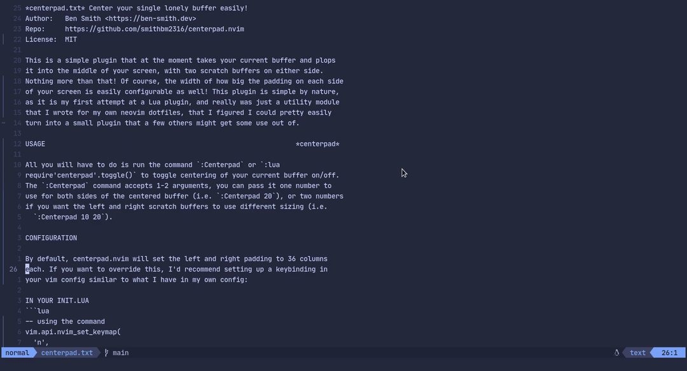

# centerpad.nvim

## Center your single lonely buffer easily!

Are you only working on one file in your current neovim session? Do you have a big monitor and have to look *all the way* to the left of your screen to see your code? centerpad.nvim is here to help you easily center your code in the middle of your screen!



## Installing

Use your favorite package manager to install, here is how to install with a few of the most popular choices I am aware of:

```lua
-- packer.nvim
use { 'smithbm2316/centerpad.nvim' }
```

```lua
-- paq.nvim
paq 'smithbm2316/centerpad.nvim'
```

```vim
" vim-plug
Plug 'smithbm2316/centerpad.nvim'
```

## Why centerpad.nvim?

This is a simple plugin that at the moment takes your current buffer and plops it into the middle of your screen, with two scratch buffers on either side. Nothing more than that! Of course, the width of how big the padding on each side of your screen is easily configurable as well! This plugin is simple by nature, as it is my first attempt at a Lua plugin, and really was just a utility module that I wrote for my own neovim dotfiles, that I figured I could pretty easily turn into a small plugin that a few others might get some use out of.

## Usage
All you will have to do is run the command `:Centerpad` or `:lua require'centerpad'.toggle()` to toggle centering of your current buffer on/off.  The `:Centerpad` command accepts 1-2 arguments, you can pass it one number to use for both sides of the centered buffer (i.e. `:Centerpad 20`), or two numbers if you want the left and right scratch buffers to use different sizing (i.e. `:Centerpad 10 20`).

## Configuration

By default, centerpad.nvim will set the left and right padding to 36 columns each. If you want to override this, I'd recommend setting up a keybinding in your vim config similar to what I have in my own config:

### In your init.lua
```lua
-- using the command
vim.api.nvim_set_keymap('n', '<leader>z', '<cmd>Centerpad<cr>', { silent = true, noremap = true })

-- or using the lua function
vim.api.nvim_set_keymap('n', '<leader>z', "<cmd>lua require'centerpad'.toggle{ leftpad = 20, rightpad = 20 }<cr>", { silent = true, noremap = true })
```

### In your init.vim
```vim
" using the command
nnoremap <silent><leader>z <cmd>Centerpad<cr>

" or using the lua function
nnoremap <silent><leader>z <cmd>lua require'centerpad'.toggle { leftpad = 36, rightpad = 36 }<cr>
```

The `leftpad` and `rightpad` options will adjust the padding for the scratch buffers on the left and right side of your main buffer, respectively.
